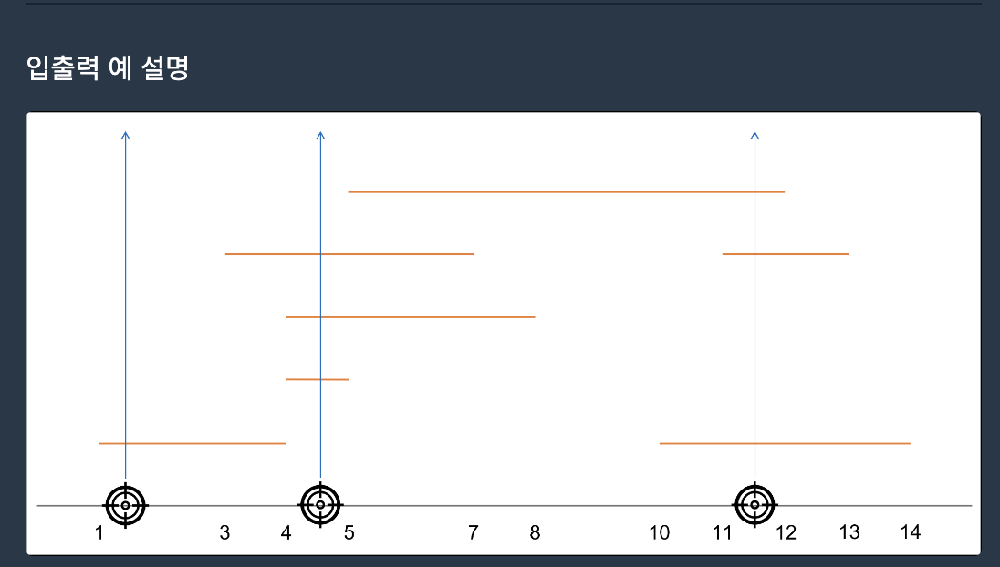

### 요격시스템
[문제링크](https://school.programmers.co.kr/learn/courses/30/lessons/181188)

자바와 친해질겸푸는 프로그래머스 알고리즘 문제
오늘은 2단계에 도전한다.

# 해결과정
1 ≤ targets의 길이 ≤ 500,000
0 ≤ s < e ≤ 100,000,000
x축 최대 길이는 억단위, 배열크기는 50만 브루트포스는 시간초과가 예상된다.
예시 그림이 유명한 그리디 문제중 하나인 회의실 시간배정이 떠올라서 그리디쪽으로 고민해봤다.


시작 지점이 끝 지점 보다 작으면 겹친다고 판단할 수 있다.
끝 지점인 e를 기준으로 정렬 후
첫번째 e를 기록
이후 반복문을 돌면서 다음 인덱스 시작지점과 비교하다가 현재 e 보다 크거나 같으면
미사일 한발 추가하고 e 새로 갱신

```
	public static int solution(int[][] targets) {
		Arrays.sort(targets, (o1, o2) -> {
			return o1[1]-o2[1];
		});
		int e = targets[0][1];
		int answer = 1;
		for (int i = 1 ; i < targets.length ; i++) {
			if (targets[i][0] >= e) {
				answer++;
				e = targets[i][1];
			}
		}
		return answer;
	}
```
겹치는 조건만 파악하면 구현은 쉬운 문제였다.
2차원 배열 정렬할 때 람다식을 사용해봤는데
``````
		Arrays.sort(targets, (o1, o2) -> {
			return o1[1]-o2[1];
		});
``````
손에 익지 않아서 아직 낯설다.
자바랑 좀 더 친해져야 할 필요가 있다.